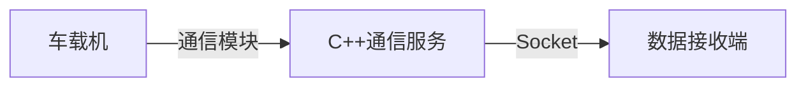
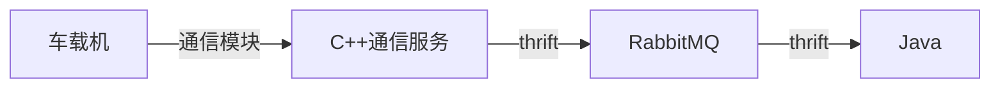

# Netty

## 背景

最近一直在做车载机数据转发，整体流程有如下两种

首先是比较老的系统，没考虑和其他系统对接，是和C++、C#对接的



这种方式直接把C++的结构体转换为字节数组并通过网络发送，关于会遇到的问题，[参照这篇](/socket/struct.md)

第二种是和使用通用协议thrift，这种协议可以和其他系统对接，当时对接的系统是Java



具体可以[参照这篇](/字符编码/encoding-001.md)

而本篇主要介绍的是netty的使用，之前一直使用mina作为socket通信框架，对比了一下netty和mina的特性，发现netty的吞吐量更大，而且社区更活跃，资料更丰富，具体的对比可以[参照](http://ifeve.com/netty-mina-in-depth-1/)这[两篇](http://ifeve.com/netty-mina-in-depth-2/)，比较深入。

## netty Server端（与Spring Boot结合）

```java
package com.ivp.netty;

import com.ivp.netty.handler.ServerHandler;
import com.ivp.util.ConstantUtil;
import io.netty.bootstrap.ServerBootstrap;
import io.netty.buffer.ByteBuf;
import io.netty.buffer.Unpooled;
import io.netty.channel.ChannelFuture;
import io.netty.channel.ChannelInitializer;
import io.netty.channel.ChannelOption;
import io.netty.channel.EventLoopGroup;
import io.netty.channel.epoll.EpollChannelOption;
import io.netty.channel.nio.NioEventLoopGroup;
import io.netty.channel.socket.nio.NioServerSocketChannel;
import io.netty.channel.socket.nio.NioSocketChannel;
import io.netty.handler.codec.DelimiterBasedFrameDecoder;
import io.netty.handler.codec.string.StringDecoder;
import io.netty.handler.codec.string.StringEncoder;
import org.slf4j.Logger;
import org.slf4j.LoggerFactory;
import org.springframework.beans.factory.annotation.Autowired;
import org.springframework.beans.factory.annotation.Value;
import org.springframework.stereotype.Component;
import org.springframework.web.client.RestTemplate;

/**
 * @文件名 NettyServer.java
 * @描述 NettyServer端
 * @author cuijiyong
 * @创建日期 2019/1/16
 */
@Component
public class NettyServer {

    private static final Logger logger = LoggerFactory.getLogger(NettyServer.class);

    @Value("${socket.server.port}")
    private int port;
    @Value("${api.realtime.subscribe}")
    private String subscribeApi;

    private final ServerHandler serverHandler;

    private EventLoopGroup pGroup;
    private EventLoopGroup cGroup;
    private ChannelFuture channelFuture;

    private final RestTemplate restTemplate;

    @Autowired
    public NettyServer(ServerHandler serverHandler, RestTemplate restTemplate) {
        this.serverHandler = serverHandler;
        this.restTemplate = restTemplate;
    }

    /**
     * 启动server
     * @throws InterruptedException
     */
    public boolean start() {

        // 先调用实时服务，订阅线路车辆状态数据
        String result = "";
        try {
            result = restTemplate.getForObject(subscribeApi, String.class);
        }catch (Exception e){
            logger.error("未能调用订阅API");
            return false;
        }
        logger.info("实时服务订阅api调用结果：{}", result);
        if(ConstantUtil.API_RESULT_SUCCESS.equals(result)){
            // 1 创建2个线程，一个是负责接收客户端的连接。一个是负责进行数据传输的
            pGroup = new NioEventLoopGroup();
            cGroup = new NioEventLoopGroup();

            // 2 创建服务器辅助类
            ServerBootstrap bootstrap = new ServerBootstrap();
            bootstrap.group(pGroup, cGroup)
                    // 使用非阻塞管道
                    .channel(NioServerSocketChannel.class)
                    .option(ChannelOption.SO_BACKLOG, 1024)
                    .option(ChannelOption.TCP_NODELAY, true)
                    .option(ChannelOption.SO_KEEPALIVE, true)
                    .option(ChannelOption.SO_REUSEADDR, true)
                    .option(ChannelOption.SO_RCVBUF, 32 * 1024)
                    .option(ChannelOption.SO_SNDBUF, 32 * 1024)
                    .option(EpollChannelOption.SO_REUSEPORT, true)
                    .childOption(ChannelOption.SO_KEEPALIVE, true)
                    .childHandler(new ChannelInitializer<NioSocketChannel>() {
                        @Override
                        protected void initChannel(NioSocketChannel sc) throws Exception {
                            // 1 设置特殊分隔符(粘包 断包)
                            ByteBuf buf = Unpooled.copiedBuffer(ConstantUtil.SPLIT_STR.getBytes());
                            sc.pipeline().addLast(new DelimiterBasedFrameDecoder(2048, buf));
                            // 2 设置字符串形式的解码
                            sc.pipeline().addLast(new StringDecoder());
                            sc.pipeline().addLast(new StringEncoder());
//                        sc.pipeline().addLast(new ObjectDecoder(ClassResolvers.cacheDisabled(null)));
//                        sc.pipeline().addLast(new ObjectDecoder(ClassResolvers.cacheDisabled(null)));
//                        sc.pipeline().addLast(new ObjectEncoder());
                            sc.pipeline().addLast(serverHandler);
                        }
                    });

            //4 绑定连接
            try {
                channelFuture = bootstrap.bind(port).sync();
            } catch (InterruptedException e) {
                e.printStackTrace();
                logger.error("服务启动失败...");
                return false;
            }
            return true;
        }else{
            logger.error("实时服务订阅api调用失败，无法启动");
            return false;
        }
    }

    /**
     * 停止server
     * @throws InterruptedException
     */
    public void close() throws InterruptedException {
        channelFuture.channel().closeFuture().sync();
        pGroup.shutdownGracefully();
        cGroup.shutdownGracefully();
    }

}
```

主要关注start部分的代码即可，这里粘贴的代码是带有业务的，需要先远程调用一个rest api，其他主要代码有注释说明

接下来是Handler的处理

```java
package com.ivp.netty.handler;

import com.ivp.netty.ServerData;
import com.ivp.util.Base64Util;
import com.ivp.util.ConstantUtil;
import com.ivp.util.JsonUtil;
import com.ivp.util.MessageBuilder;
import io.netty.channel.ChannelHandler;
import io.netty.channel.ChannelHandlerContext;
import io.netty.channel.ChannelInboundHandlerAdapter;
import org.slf4j.Logger;
import org.slf4j.LoggerFactory;
import org.springframework.beans.factory.annotation.Autowired;
import org.springframework.beans.factory.annotation.Value;
import org.springframework.core.ParameterizedTypeReference;
import org.springframework.http.HttpMethod;
import org.springframework.stereotype.Component;
import org.springframework.web.client.RestTemplate;

import java.util.HashMap;
import java.util.List;
import java.util.Map;

/**
 * @文件名 ServerHandler.java
 * @描述 Netty服务接收数据处理
 * @author cuijiyong
 * @创建日期 2019/1/16
 */
@Component
@ChannelHandler.Sharable
public class ServerHandler extends ChannelInboundHandlerAdapter {

    private Logger logger = LoggerFactory.getLogger(ServerHandler.class);

    @Value("${api.base.login}")
    private String apiLogin;

    private final RestTemplate restTemplate;

    @Autowired
    public ServerHandler(RestTemplate restTemplate) {
        this.restTemplate = restTemplate;
    }

    @Override
    public void channelActive(ChannelHandlerContext ctx) throws Exception {
        // 客户端上线  TODO
        ServerData.putOnLine(ctx.channel().id()+"", ctx.channel());
        logger.info("用户上线：{}", ctx.channel().id());
    }

    @Override
    public void channelRead(ChannelHandlerContext ctx, Object msg) throws Exception {
//        logger.info("收到数据: {}", msg);
        String json = Base64Util.decodeData((String) msg);
        Map<String, Object>  messageMap = JsonUtil.json2map(json);
        if(messageMap !=  null){
            String functionType = String.valueOf(messageMap.get(ConstantUtil.MESSAGE_TYPE_KEY));
            switch (functionType){
                // 如果是基础服务类型
                case ConstantUtil.OUT_TYPE_BASE:{
                    operateMessageBase(ctx, messageMap);
                    break;
                }
                // 如果是实时数据类型
                case ConstantUtil.OUT_TYPE_REALTIME: {
                    operateMessageRealtime(ctx, messageMap);
                    break;
                }
                default:
                    break;
            }
        }

       /* byte[] bytes = (byte[]) msg;
        String str = new String(bytes).replaceAll("\r\n", "");
        System.out.println("服务器收到数据:   " + str);
        String response = "00000200B683395C010000000B000000C900000000000000C9000000000000002F4C0200090000000800000036B2000000000000" + "\r\n";
        ctx.writeAndFlush(response.getBytes("GB2312"));
        response = "00000100B683395CDCDC436902000000D5D000005D25245611C60000352CB125B683395C00000000" + "\r\n";
        ctx.writeAndFlush(response);*/
    }

    /**
     * 处理基础服务消息
     * @param ctx
     * @param messageMap
     */
    private void operateMessageBase(ChannelHandlerContext ctx, Map<String, Object> messageMap) {
        String functionCode = String.valueOf(messageMap.get(ConstantUtil.MESSAGE_CODE_KEY));
        switch (functionCode){
            // 如果是心跳
            case ConstantUtil.OUT_CODE_HEARTBEAT: {
                String data = new MessageBuilder().type(ConstantUtil.OUT_TYPE_BASE)
                        .code(ConstantUtil.OUT_CODE_HEARTBEAT)
                        .appendData("heartbeatFlag", "0").build();
                ctx.writeAndFlush(data);
                break;
            }
            // 如果是登录
            case ConstantUtil.OUT_CODE_LOGIN: {
                // 调用登录接口，获取登录结果 TODO
                Map<String, Object> loginResult = restTemplate.exchange(apiLogin, HttpMethod.POST,
                        null, new ParameterizedTypeReference<Map<String, Object>>() {
                }).getBody();
                break;
            }
            default:
                break;
        }
    }

    /**
     * 处理实时数据消息
     * @param ctx
     * @param messageMap
     */
    private void operateMessageRealtime(ChannelHandlerContext ctx, Map<String, Object> messageMap) {
        String functionCode = String.valueOf(messageMap.get(ConstantUtil.MESSAGE_CODE_KEY));
        switch (functionCode){
            // 如果是订阅GPS消息
            case ConstantUtil.OUT_CODE_BUS_GPS:{
                List<Map<String, Object>> jsonData = (List<Map<String, Object>>) messageMap.get("jsonData");
                if(jsonData != null && !jsonData.isEmpty()){
                    Map<String, Object> jsonRow = jsonData.get(0);
                    if(ConstantUtil.SUBSCRIBE_ENABLE.equals(jsonRow.get("subscribe"))){
                        logger.info("用户订阅GPS数据");
                        // 将当前用户追加至订阅列表
                        ServerData.putSub(ctx.channel().id()+"", ctx.channel());
                    }else{
                        logger.info("用户取消订阅GPS数据");
                        // 将当前用户在订阅列表里删除
                        ServerData.removeSub(ctx.channel().id()+"");
                    }
                }
                break;
            }
            default:
                break;
        }
    }

    @Override
    public void channelReadComplete(ChannelHandlerContext ctx) throws Exception {
        super.channelReadComplete(ctx);
        ctx.flush();
    }

    @Override
    public void exceptionCaught(ChannelHandlerContext ctx, Throwable cause) throws Exception {
        super.exceptionCaught(ctx, cause);
        ctx.close();
    }

    @Override
    public void channelUnregistered(ChannelHandlerContext ctx) throws Exception {
        // 客户端下线　 TODO
        ServerData.remove(ctx.channel().id()+"");
        logger.info("用户下线：{}", ctx.channel().id()+"");
    }

}
```

注意两点：

1. 继承ChannelInboundHandlerAdapter
2. 各个回调方法的调用时机

最后是启动类

```java
package com.ivp;

import com.ivp.netty.NettyServer;
import com.ivp.receiver.Converter;
import org.springframework.beans.factory.annotation.Autowired;
import org.springframework.boot.CommandLineRunner;
import org.springframework.boot.SpringApplication;
import org.springframework.boot.autoconfigure.SpringBootApplication;
import org.springframework.cache.annotation.EnableCaching;
import org.springframework.context.annotation.Bean;
import org.springframework.scheduling.annotation.EnableScheduling;
import org.springframework.web.client.RestTemplate;

@SpringBootApplication
//@MapperScan({ "com.framework.dao" })
@EnableScheduling
@EnableCaching
//@EnableCaching
public class ForwardApplication implements CommandLineRunner {

	private final NettyServer nettyServer;
	private final Converter converter;

	@Autowired
	public ForwardApplication(NettyServer nettyServer, Converter converter) {
		this.nettyServer = nettyServer;
		this.converter = converter;
	}

	public static void main(String[] args) {
		SpringApplication.run(ForwardApplication.class, args);
	}

	/**
	 * boot状态监听
	 * @param args
	 * @throws Exception
	 */
	@Override
	public void run(String... args)  {

		// boot启动同时启动socket
		while(!nettyServer.start()){
			try {
				Thread.sleep(5000);
			} catch (InterruptedException e) {
				e.printStackTrace();
			}
		}
		Runtime.getRuntime().addShutdownHook(new Thread(() -> {
			try {
				// boot关闭同时关闭socket
				nettyServer.close();
			} catch (InterruptedException e) {
				e.printStackTrace();
			}
		}));
//		convertAndSender.send();
		converter.convert();
	}
}
```

需要注意的地方：

1. Spring Boot应用起停状态监听，做到应用启动完成就启动netty server，应用停止时就停止netty server
2. netty server的循环启动处理，当发现启动失败，休眠5秒再重启

## netty Client端（与Spring Boot结合）

```java
package com.ivp.netty;

import com.ivp.entity.BSBCPAction;
import com.ivp.entity.BSBCPHeartbeat;
import com.ivp.entity.BSBCPLogin;
import com.ivp.entity.SenderEntity;
import com.ivp.netty.handler.ClientHandler;
import com.ivp.netty.coder.IvpEncoderForCSharp;
import com.ivp.util.ConstantUtil;
import io.netty.bootstrap.Bootstrap;
import io.netty.buffer.ByteBuf;
import io.netty.buffer.Unpooled;
import io.netty.channel.*;
import io.netty.channel.nio.NioEventLoopGroup;
import io.netty.channel.socket.SocketChannel;
import io.netty.channel.socket.nio.NioSocketChannel;
import io.netty.handler.codec.DelimiterBasedFrameDecoder;
import org.slf4j.Logger;
import org.slf4j.LoggerFactory;
import org.springframework.amqp.core.AmqpTemplate;
import org.springframework.beans.factory.annotation.Autowired;
import org.springframework.beans.factory.annotation.Value;
import org.springframework.context.annotation.Scope;
import org.springframework.scheduling.annotation.Scheduled;
import org.springframework.stereotype.Component;

import java.util.concurrent.TimeUnit;

/**
 * @文件名 NettyClient.java
 * @描述 Netty客户端
 * @author cuijiyong
 * @创建日期 2019/1/16
 */
@Component
public class NettyClient {

    private static Logger logger = LoggerFactory.getLogger(NettyClient.class);

    @Value("${socket.server.ip}")
    private String socketIp;
    @Value("${socket.server.port}")
    private int socketPort;
    @Value("${socket.server.username}")
    private String socketUsername;
    @Value("${socket.server.password}")
    private String socketPassword;

    private final ClientHandler clientHandler;

    private EventLoopGroup group;
    private ChannelFuture channelFuture;
    private Bootstrap bootstrap;

    private final AmqpTemplate amqpTemplate;

    @Autowired
    public NettyClient(ClientHandler clientHandler, AmqpTemplate amqpTemplate) {
        this.clientHandler = clientHandler;
        this.amqpTemplate = amqpTemplate;
    }

    /**
     * 启动客户端
     */
    public void start() {

      /*  while(true){
            amqpTemplate.convertAndSend("q_bus_state_all", "lskdjflksjdflksjdflkjsdlkfjsldkfjslkdjflskdjflksjdlfkjsd\r\n");
        }*/

        group = new NioEventLoopGroup();
        //1
        bootstrap = new Bootstrap();
        //2
        bootstrap.group(group)
                //3
                .channel(NioSocketChannel.class)
                .option(ChannelOption.SO_BACKLOG, 1024)
                .option(ChannelOption.SO_SNDBUF, 1024)
                .option(ChannelOption.SO_RCVBUF, 1024)
                .option(ChannelOption.CONNECT_TIMEOUT_MILLIS, 10000)
                //4
                .handler(new ChannelInitializer<SocketChannel>() {
                    @Override
                    protected void initChannel(SocketChannel sc) throws Exception {
                        //1
                        ByteBuf buf = Unpooled.copiedBuffer("\r\n".getBytes());
                        //2
                        sc.pipeline().addLast(new DelimiterBasedFrameDecoder(1024, buf));
//                        sc.pipeline().addLast(new IvpDecoderForCSharp());
//                        sc.pipeline().addLast(new ObjectDecoder(ClassResolvers.cacheDisabled(null)));
//                        sc.pipeline().addLast(new ObjectEncoder());
                        sc.pipeline().addLast(new IvpEncoderForCSharp());
                        //在这里配置具体数据接收方法的处理
                        sc.pipeline().addLast(clientHandler);
                    }
                });

        clientHandler.setInActiveListener(() -> {
            //重新连接服务器
            channelFuture.channel().eventLoop().schedule(this::doConnect, 2, TimeUnit.SECONDS);
        });

        //5
        doConnect();

//        cf1.channel().writeAndFlush(new byte[]{0, 9, 6, 1,
//                100,112,116,101,115,116,49});
//        Thread.sleep(1000);
//        cf1.channel().writeAndFlush(Unpooled.copiedBuffer("666\r\n".getBytes()));
//        Thread.sleep(1000);
//        cf1.channel().writeAndFlush(Unpooled.copiedBuffer("888\r\n".getBytes()));

//        cf1.channel().closeFuture().sync();
//        //等待关闭
//        group.shutdownGracefully();
    }

    public void doConnect() {
//        try {
            channelFuture = bootstrap.connect(socketIp, socketPort);
            channelFuture.addListener((ChannelFutureListener) channelFuture -> {
                if (channelFuture.isSuccess()) {
                    // 发送登录消息
                    sendLogin();
                    logger.info("连接服务器成功");
                } else {
                    logger.info("连接服务器失败，准备重连");
                    //  5秒后重新连接
                    channelFuture.channel().eventLoop().schedule(this::doConnect, 5, TimeUnit.SECONDS);
                }
            });
//        } catch (InterruptedException e) {
//            e.printStackTrace();
//            logger.info("连接异常");
//        }
        // 本地测试
//        ChannelFuture cf1 = b.connect("10.19.210.158", 11338).sync();
    }

    private void sendLogin() {
        BSBCPAction bsbcpAction = new BSBCPAction();
        bsbcpAction.setMessageType(ConstantUtil.BSBCP_CMD_LOGIN);
//        BSBCPAction.setContent(new byte[]{0, 9, 0, 6, 1,
//                100,112,116,101,115,116,49});
        BSBCPLogin bsbcplogin = new BSBCPLogin();
        bsbcplogin.setUserType((short) 1);
        bsbcplogin.setUsername(socketUsername);
        bsbcplogin.setPassword(socketPassword);
        bsbcpAction.setContentLength(bsbcplogin.getTotalLength());
        SenderEntity senderEntity = new SenderEntity(bsbcpAction, bsbcplogin);
        channelFuture.channel().writeAndFlush(senderEntity);
    }

    /**
     * 关闭客户端
     */
    public void close() {
        try {
            channelFuture.channel().closeFuture().sync();
        } catch (InterruptedException e) {
            e.printStackTrace();
            logger.error("netty关闭失败");
        }
        //等待关闭
        group.shutdownGracefully();
    }

    /**
     * 定时发送心跳包
     */
    @Scheduled(fixedDelayString = "${socket.heartbeat.delay}")
    public void sendHeartBeat(){
        if(channelFuture != null) {
            BSBCPAction bsbcpaction = new BSBCPAction();
            bsbcpaction.setMessageType(ConstantUtil.BSBCP_CMD_HEARTBEAT);
            BSBCPHeartbeat bsbcpheartbeat = new BSBCPHeartbeat();
            bsbcpheartbeat.setReceiverTime(0);
            bsbcpheartbeat.setSenderTime((int) (System.currentTimeMillis() / 1000));
            bsbcpaction.setContentLength(BSBCPHeartbeat.DATA_LENGTH);
            SenderEntity senderEntity = new SenderEntity(bsbcpaction, bsbcpheartbeat);
            channelFuture.channel().writeAndFlush(senderEntity);
        }
    }

}
```

主要注意setInActiveListener中的断线重连实现，断线后2秒发起重连。doConnect方法中的addListener，是指初始连接时连接失败的重连，5秒一次。

客户端Handler处理

```java
package com.ivp.netty.handler;

import com.ivp.entity.*;
import com.ivp.entity.output.LogicDataEntity;
import com.ivp.entity.struct.*;
import com.ivp.netty.NettyClient;
import com.ivp.util.ConstantUtil;
import com.ivp.util.HexUtil;
import com.ivp.util.ProtocolUtil;
import io.netty.buffer.ByteBuf;
import io.netty.channel.ChannelHandler;
import io.netty.channel.ChannelHandlerContext;
import io.netty.channel.ChannelInboundHandlerAdapter;
import io.netty.util.ReferenceCountUtil;
import org.slf4j.Logger;
import org.slf4j.LoggerFactory;
import org.springframework.amqp.core.AmqpTemplate;
import org.springframework.beans.factory.annotation.Autowired;
import org.springframework.beans.factory.annotation.Value;
import org.springframework.stereotype.Component;
import org.springframework.web.client.RestTemplate;

import java.util.*;
import java.util.concurrent.TimeUnit;

/**
 * @文件名 ClientHandler.java
 * @描述 客户端收到数据处理类
 * @author cuijiyong
 * @创建日期 2019/1/16
 */
@Component
@ChannelHandler.Sharable
public class ClientHandler extends ChannelInboundHandlerAdapter {

    private Logger logger = LoggerFactory.getLogger(ClientHandler.class);

    private InActiveListener inActiveListener;

    @Value("${q_bus_state_all}")
    private String qBusStateAll;

    @Value("${api.url}")
    private String apiUrl;

    private final AmqpTemplate amqpTemplate;

    private final RestTemplate restTemplate;

//    private final NettyClient nettyClient;

    private Integer userCode;
    private ChannelHandlerContext ctx;

    @Autowired
    public ClientHandler(AmqpTemplate amqpTemplate, RestTemplate restTemplate) {
        this.amqpTemplate = amqpTemplate;
        this.restTemplate = restTemplate;
    }

    @Override
    public void channelActive(ChannelHandlerContext ctx) throws Exception {
        super.channelActive(ctx);
        this.ctx = ctx;
    }
    @Override
    public void channelRead(ChannelHandlerContext ctx, Object msg) throws Exception {
        try {
            // 获取接收到的数据
            ByteBuf byteBuf = (ByteBuf) msg;
            byte[] bytes = new byte[byteBuf.readableBytes()];
            byteBuf.readBytes(bytes);
            // 转换hex并去除断包符
            String hexStr = new String(bytes).replaceAll(ConstantUtil.SPLIT_STR, "");
            // 转换字节数组
            byte[] messageBytes = HexUtil.hex2Bytes(hexStr);
            // 获取指令头
            BSBCPAction bsbcpAction = (BSBCPAction) ProtocolUtil.getEntity(messageBytes, 0, BSBCPActionStruct.class);
//            logger.info("BSBCPAction ======== {}", Arrays.toString(messageBytes));

            // 判断指令头
            switch (bsbcpAction.getMessageType()){
                // 心跳
                case ConstantUtil.BSBCP_CMD_HEARTBEAT:{
                    BSBCPHeartbeat bsbcpheartbeat = (BSBCPHeartbeat) ProtocolUtil.getEntity(messageBytes,
                            BSBCPAction.MESSAGE_LENGTH, BSBCPHeartbeatStruct.class);
                    logger.info("收到心跳包：{}", bsbcpheartbeat);
                    break;
                }
                // 服务器回复
                case ConstantUtil.BSBCP_CMD_REPLY:{
                    BSBCPReply bsbcpReply = (BSBCPReply) ProtocolUtil.getEntity(messageBytes,
                            BSBCPAction.MESSAGE_LENGTH,
                            BSBCPReplyStruct.class);
                    if(bsbcpReply != null){
                        operateCmdReply(bsbcpReply, messageBytes, ctx);
                    }else{
                        logger.error("解析错误，空的reply");
                    }
                    break;
                }
                // 车辆状态
                case ConstantUtil.BSBCP_CMD_BUS_STATE:{
                    BSBCPBusState bsbcpBusState = (BSBCPBusState) ProtocolUtil.getEntity(messageBytes,
                            BSBCPAction.MESSAGE_LENGTH, BSBCPBusStateStruct.class);
                    if(bsbcpBusState != null) {
                        operateCmdBusState(bsbcpBusState, messageBytes, ctx);
                    }else{
                        logger.error("解析错误，空的bus state");
                    }
                    break;
                }
                default:
                    break;
            }
        }catch (Exception e){
            e.printStackTrace();
        }finally {
            ReferenceCountUtil.release(msg);
        }
    }

    /**
     * 车辆状态消息处理
     * @param bsbcpBusState 车辆状态
     * @param messageBytes 消息数据
     * @param ctx netty管道
     */
    private void operateCmdBusState(BSBCPBusState bsbcpBusState, byte[] messageBytes, ChannelHandlerContext ctx) {
        switch (bsbcpBusState.getDataType()){
            // 车机所有数据
            case ConstantUtil.BUS_STATE_TYPE_ALL:{
                BSBCPBusStateAll bsbcpBusStateAll = (BSBCPBusStateAll) ProtocolUtil.getEntity(messageBytes,
                        BSBCPAction.MESSAGE_LENGTH, BSBCPBusStateAllStruct.class);
                buildJsonAndSend(bsbcpBusStateAll.getDataType(), bsbcpBusStateAll);
                break;
            }
            // GPS数据
            case ConstantUtil.BUS_STATE_TYPE_GPS:{
                BSBCPBusStateGPS bsbcpBusStateGPS = (BSBCPBusStateGPS) ProtocolUtil.getEntity(messageBytes,
                        BSBCPAction.MESSAGE_LENGTH, BSBCPBusStateGPSStruct.class);
                buildJsonAndSend(bsbcpBusStateGPS.getDataType(), bsbcpBusStateGPS);
                break;
            }
            // 车辆状态：司机
            case ConstantUtil.BUS_STATE_TYPE_SJ:{
                BSBCPBusStateDriver bsbcpBusStateDriver = (BSBCPBusStateDriver) ProtocolUtil.getEntity(messageBytes,
                        BSBCPAction.MESSAGE_LENGTH, BSBCPBusStateDriverStruct.class);
                buildJsonAndSend(bsbcpBusStateDriver.getDataType(), bsbcpBusStateDriver);
                break;
            }
            // 车辆状态：上线
            case ConstantUtil.BUS_STATE_TYPE_ONLINE:{
                BSBCPBusStateOnLine bsbcpBusStateOnLine = (BSBCPBusStateOnLine) ProtocolUtil.getEntity(messageBytes,
                        BSBCPAction.MESSAGE_LENGTH, BSBCPBusStateOnLineStruct.class);
                buildJsonAndSend(bsbcpBusStateOnLine.getDataType(), bsbcpBusStateOnLine);
                break;
            }
            // 车辆状态：离线
            case ConstantUtil.BUS_STATE_TYPE_LEAVELINE:{
                BSBCPBusStateLeaveLine bsbcpBusStateLeaveLine = (BSBCPBusStateLeaveLine) ProtocolUtil.getEntity(messageBytes,
                        BSBCPAction.MESSAGE_LENGTH, BSBCPBusStateLeaveLineStruct.class);
                buildJsonAndSend(bsbcpBusStateLeaveLine.getDataType(), bsbcpBusStateLeaveLine);
                break;
            }
            // 车辆状态：换线
            case ConstantUtil.BUS_STATE_CHANGE_LINE:{
                BSBCPBusStateChangeLine bsbcpBusStateChangeLine = (BSBCPBusStateChangeLine) ProtocolUtil.getEntity(messageBytes,
                        BSBCPAction.MESSAGE_LENGTH, BSBCPBusStateChaneLineStruct.class);
                buildJsonAndSend(bsbcpBusStateChangeLine.getDataType(), bsbcpBusStateChangeLine);
                break;
            }
            // 车辆状态：报站
            case ConstantUtil.BUS_STATE_TYPE_STATION:{
                BSBCPBusStateStation bsbcpBusStateStation = (BSBCPBusStateStation) ProtocolUtil.getEntity(messageBytes,
                        BSBCPAction.MESSAGE_LENGTH, BSBCPBusStateStationStruct.class);
                buildJsonAndSend(bsbcpBusStateStation.getDataType(), bsbcpBusStateStation);
                break;
            }
            // 车辆状态：109
            case ConstantUtil.BUS_STATE_TYPE_LOGIC: {
                BSBCPBusStateAll bsbcpBusStateAll = (BSBCPBusStateAll) ProtocolUtil.getEntity(messageBytes,
                        BSBCPAction.MESSAGE_LENGTH, BSBCPBusStateAllStruct.class);
                buildJsonAndSend(bsbcpBusStateAll.getDataType(), bsbcpBusStateAll);
                break;
            }
            default:
                break;
        }
    }

    /**
     * 构造json并发送
     * @param type
     * @param data
     */
    private void buildJsonAndSend(short type, BaseEntity data) {
        if(data != null){
            String json = new LogicDataEntity().type(ConstantUtil.OUT_TYPE_REALTIME)
                    .code(ConstantUtil.MSG_TPYE_MAPPING.get(type)).jsondata(data).build();
//            if(type == 0 ){
                logger.info("收到车辆状态数据，类型：{}, 数据：{}", type, data);
//            }
            amqpTemplate.convertAndSend(qBusStateAll, json);
        }else{
            logger.error("解析错误，空的bus state , type：{}", type);
        }
    }

    /**
     * 服务器回复处理
     * @param bsbcpReply 服务器回复消息
     * @param messageBytes 消息bytes
     * @param ctx netty管道
     */
    private void operateCmdReply(BSBCPReply bsbcpReply, byte[] messageBytes, ChannelHandlerContext ctx) {
//        logger.info("收到回复：{}", bsbcpReply);
        switch (bsbcpReply.getReplyType()){
            // 心跳不处理
            case ConstantUtil.BSBCP_CMD_HEARTBEAT:{
                BSBCPHeartbeat bsbcpHeartbeat = (BSBCPHeartbeat) ProtocolUtil.getEntity(messageBytes,
                        BSBCPAction.MESSAGE_LENGTH + BSBCPReply.MESSAGE_LENGTH,
                        BSBCPHeartbeatStruct.class);
//                logger.info("收到服务器回复心跳：{}", bsbcpHeartbeat);
                break;
            }
            // 登录结果
            case ConstantUtil.BSBCP_CMD_LOGIN:{
                BSBCPLoginResult bsbcploginresult = (BSBCPLoginResult) ProtocolUtil.getEntity(messageBytes,
                        BSBCPAction.MESSAGE_LENGTH + BSBCPReply.MESSAGE_LENGTH ,
                        BSBCPLoginResultStruct.class);
                logger.info("登录结果：{}", bsbcploginresult);
                // 登录成功
                if(bsbcploginresult != null && bsbcploginresult.getPassRight() == 0 && bsbcploginresult.getUserExist() == 0){
                    logger.info("用户 {} 登录成功，开始订阅全部消息", bsbcploginresult.getUserCode());
                    this.userCode = bsbcploginresult.getUserCode();
                    senderEntitySubscribeLine();
                }else{
                    logger.error("用户登录失败");
                }
                break;
            }
            default:
                break;
        }
    }

    /**
     * 构造订阅车辆状态信息指令
     * @return
     */
    private SenderEntity getSenderEntitySubscribe() {
        BSBCPAction subscribe = new BSBCPAction();
        subscribe.setMessageType(ConstantUtil.BSBCP_CMD_OPERATION);
        BSBCPOperationSubscribe bsbcpoperationsubscribe = new BSBCPOperationSubscribe();
        bsbcpoperationsubscribe.setState(ConstantUtil.BUS_STATE_OPEN);
//        bsbcpoperationsubscribe.setOptType(ConstantUtil.BUS_STATE_TYPE_GPS);
        bsbcpoperationsubscribe.setOptType(ConstantUtil.BUS_STATE_TYPE_ALL);
        subscribe.setContentLength(BSBCPOperationSubscribe.SUBSCRIBE_LENGTH);
        return new SenderEntity(subscribe, bsbcpoperationsubscribe);
    }

    /**
     * 构造订阅指定线路车辆状态信息指令
     * @return
     */
    public String senderEntitySubscribeLine() {
        if(userCode == 0 || ctx == null){
            return ConstantUtil.API_RESULT_FAILURE;
        }else {
            // TODO 调用管理端接口获取所有线路
            // Map<String, Object> lineMap =  restTemplate.getForObject(apiUrl, Map.class);
            // 测试线路
//            List<Integer> lines = Arrays.asList(1,109,117,21205,21062,919,103,106);
            // 正式线路
            List<Integer> lines = Arrays.asList(0, 1, 2, 3, 20483, 5, 6, 7, 8, 9, 10, 11, 12, 13, 14, 15, 16, 18, 19, 20, 21, 22, 23, 24, 25, 26, 27, 28, 29, 30, 31, 32, 33, 34, 35, 36, 38, 39, 40, 41, 42, 43, 45, 46, 47, 48, 49, 50, 51, 52, 53, 54, 55, 56, 57, 58, 59, 60, 61, 64, 65, 66, 67, 68, 70, 71, 72, 73, 74, 75, 76, 77, 78, 79, 80, 81, 82, 83, 85, 86, 87, 88, 89, 90, 91, 92, 93, 94, 95, 96, 97, 98, 101, 102, 103, 104, 10344, 10345, 105, 106, 107, 108, 109, 110, 111, 112, 113, 114, 115, 116, 117, 118, 119, 120, 10360, 121, 122, 123, 124, 125, 126, 10366, 128, 130, 131, 132, 133, 138, 139, 140, 26809, 4300, 22818, 22827, 301, 302, 303, 4399, 304, 306, 307, 308, 309, 22837, 310, 22838, 311, 312, 313, 314, 315, 316, 317, 318, 320, 321, 322, 323, 324, 325, 326, 327, 328, 329, 330, 331, 332, 333, 334, 335, 336, 337, 338, 339, 22867, 341, 22869, 342, 343, 345, 346, 347, 348, 349, 350, 351, 352, 353, 355, 356, 357, 22885, 358, 359, 360, 22888, 361, 22889, 362, 363, 364, 365, 366, 369, 370, 371, 372, 373, 374, 375, 376, 377, 378, 379, 380, 22908, 381, 383, 384, 385, 22914, 386, 387, 388, 389, 390, 391, 10631, 392, 22920, 393, 394, 395, 396, 22924, 397, 398, 401, 402, 403, 404, 22932, 405, 407, 408, 409, 22937, 410, 411, 22939, 414, 415, 416, 22944, 417, 418, 419, 421, 423, 425, 22955, 428, 22956, 22957, 430, 431, 25008, 432, 25009, 435, 25012, 436, 437, 438, 22966, 439, 440, 441, 442, 445, 446, 447, 449, 452, 453, 454, 455, 456, 457, 22985, 458, 459, 460, 22988, 461, 462, 463, 464, 465, 466, 22994, 467, 468, 22996, 469, 22997, 470, 471, 472, 473, 474, 475, 476, 477, 478, 480, 481, 483, 484, 485, 486, 487, 488, 489, 490, 493, 496, 497, 498, 499, 501, 505, 506, 507, 508, 509, 510, 511, 512, 513, 515, 516, 517, 518, 519, 520, 521, 523, 524, 21004, 21005, 525, 527, 21008, 528, 529, 21009, 530, 21010, 531, 21011, 532, 533, 21013, 534, 535, 536, 21016, 537, 21017, 538, 21019, 539, 21021, 21022, 543, 21023, 544, 21025, 545, 546, 547, 21028, 21029, 549, 551, 552, 553, 554, 21035, 555, 556, 557, 21037, 558, 21038, 559, 21039, 560, 21040, 561, 21041, 563, 10805, 565, 21045, 21046, 567, 568, 21048, 569, 21049, 21050, 570, 571, 23101, 21054, 574, 10815, 21055, 575, 23103, 576, 21056, 577, 23105, 21057, 23106, 21058, 10818, 578, 579, 580, 23108, 21060, 23109, 21062, 23110, 582, 583, 584, 21065, 23114, 586, 21066, 21067, 587, 589, 21069, 21070, 23118, 21071, 591, 23119, 21072, 23120, 593, 23121, 594, 23122, 23123, 10835, 21075, 596, 23125, 597, 598, 21078, 599, 23128, 601, 21081, 23129, 21082, 602, 21084, 605, 23133, 21085, 606, 21086, 607, 21087, 21089, 10850, 610, 23138, 21091, 611, 23139, 612, 23140, 614, 23142, 615, 616, 23144, 21096, 21097, 21098, 618, 23146, 619, 21099, 23147, 620, 621, 21101, 23149, 622, 21103, 23151, 624, 23152, 21105, 23153, 625, 21106, 23154, 627, 23155, 21107, 21108, 23156, 23157, 630, 23158, 631, 23159, 632, 21112, 633, 21113, 23161, 634, 23162, 23163, 635, 23164, 636, 21116, 21117, 637, 638, 23166, 639, 640, 10880, 21120, 23169, 641, 21121, 642, 643, 4740, 645, 646, 23174, 647, 650, 651, 652, 653, 655, 657, 658, 659, 660, 10901, 663, 664, 665, 666, 667, 668, 669, 670, 671, 672, 673, 674, 23202, 10915, 675, 10916, 676, 10917, 677, 678, 10919, 679, 680, 681, 682, 684, 21167, 21168, 21169, 690, 691, 692, 693, 694, 10935, 695, 696, 10938, 698, 701, 10941, 10942, 21204, 21205, 10970, 736, 10977, 10980, 751, 23303, 23304, 23305, 23306, 23307, 23308, 23309, 23310, 23313, 23315, 23316, 23318, 23321, 23322, 4891, 23325, 23327, 23328, 23329, 802, 23330, 23331, 23332, 804, 805, 806, 23334, 807, 23335, 808, 809, 23337, 810, 23338, 811, 812, 23340, 813, 23341, 23342, 814, 815, 23343, 816, 23344, 817, 23345, 818, 23346, 819, 23347, 820, 821, 822, 824, 826, 827, 828, 829, 830, 831, 833, 834, 835, 836, 837, 838, 839, 840, 841, 842, 843, 844, 845, 846, 847, 848, 849, 850, 851, 852, 854, 855, 856, 857, 860, 865, 866, 868, 870, 871, 872, 878, 879, 880, 23409, 23410, 883, 884, 885, 886, 887, 889, 890, 892, 895, 896, 897, 898, 899, 901, 902, 904, 905, 906, 907, 908, 909, 910, 911, 33680, 914, 915, 916, 917, 918, 919, 922, 924, 925, 926, 927, 928, 929, 930, 931, 933, 934, 935, 937, 938, 939, 941, 942, 943, 944, 945, 947, 5044, 948, 949, 951, 952, 954, 955, 957, 958, 959, 960, 961, 962, 963, 15300, 965, 966, 967, 968, 969, 970, 972, 23501, 973, 23503, 975, 976, 977, 978, 23507, 979, 980, 981, 982, 983, 984, 985, 986, 987, 988, 989, 990, 991, 992, 993, 23522, 994, 996, 23524, 997, 998, 23527, 23528, 23680, 23701, 23709, 5300, 34011, 34027, 34034, 23801, 34041, 5399, 27938, 23905, 23906, 23908, 23909, 24008, 24009, 24012, 22003, 22022, 22032, 20002, 20004, 20007, 20011, 20013, 20014, 20015, 20016, 20017, 22066, 20019, 22075, 22101, 5740, 22129, 20107, 22166, 20206, 5891, 9998, 9999, 22409, 20401, 20402, 20403, 4044, 14300, 22507, 22517);
            for (Integer lineNo : lines) {
                BSBCPAction subscribe = new BSBCPAction();
                subscribe.setMessageType(ConstantUtil.BSBCP_CMD_OPERATION);
                subscribe.setSenderType(userCode);
                BSBCPOperationSubscribeLine bsbcpoperationsubscribe = new BSBCPOperationSubscribeLine();
                bsbcpoperationsubscribe.setLineNo(lineNo);
//        bsbcpoperationsubscribe.setOptType(ConstantUtil.BUS_STATE_TYPE_GPS);
                bsbcpoperationsubscribe.setOptType(ConstantUtil.BUS_STATE_TYPE_ALL_GET);
                subscribe.setContentLength(BSBCPOperationSubscribeLine.SUBSCRIBE_LENGTH);
                // 订阅指定线路的消息
                ctx.writeAndFlush(new SenderEntity(subscribe, bsbcpoperationsubscribe));
            }
            // 发送订阅gps消息
            SenderEntity senderEntity = getSenderEntitySubscribe();
            ctx.writeAndFlush(senderEntity);
            return ConstantUtil.API_RESULT_SUCCESS;
        }
    }

    @Override
    public void channelReadComplete(ChannelHandlerContext ctx) throws Exception {
        super.channelReadComplete(ctx);
        ctx.flush();
    }

    /**
     * 断线重连
     * @param ctx
     * @throws Exception
     */
    @Override
    public void channelInactive(ChannelHandlerContext ctx) throws Exception {
        super.channelInactive(ctx);
        logger.info("与服务器连接已断开...");
        inActiveListener.onChannelInactive();
        this.ctx = null;
        ctx.close();
    }

    public Integer getUserCode() {
        return userCode;
    }

    public void setUserCode(Integer userCode) {
        this.userCode = userCode;
    }

    public InActiveListener getInActiveListener() {
        return inActiveListener;
    }

    public void setInActiveListener(InActiveListener inActiveListener) {
        this.inActiveListener = inActiveListener;
    }

    public ChannelHandlerContext getCtx() {
        return ctx;
    }

    public void setCtx(ChannelHandlerContext ctx) {
        this.ctx = ctx;
    }

    public interface InActiveListener{
        void onChannelInactive();
    }

}
```

注意channelInactive方法中的重连处理，这里自己做了个回调接口InActiveListener。

客户端启动类

```java
package com.ivp;

import com.ivp.entity.BSBCPBusStateAll;
import com.ivp.entity.struct.BSBCPBusStateAllStruct;
import com.ivp.netty.NettyClient;
import com.ivp.util.HexUtil;
import com.ivp.util.ProtocolUtil;
import org.slf4j.Logger;
import org.slf4j.LoggerFactory;
import org.springframework.beans.factory.annotation.Autowired;
import org.springframework.boot.CommandLineRunner;
import org.springframework.boot.SpringApplication;
import org.springframework.boot.autoconfigure.SpringBootApplication;
import org.springframework.context.annotation.Bean;
import org.springframework.scheduling.annotation.EnableScheduling;
import org.springframework.web.client.RestTemplate;

/**
 * @文件名 RealTimeApplication.java
 * @描述 实时服务启动类
 * @author cuijiyong
 * @创建日期 2019/1/16
 */
@SpringBootApplication
//@MapperScan({ "com.framework.dao" })
@EnableScheduling
//@EnableCaching
public class RealTimeApplication implements CommandLineRunner {

	private static Logger logger = LoggerFactory.getLogger(RealTimeApplication.class);

	private final NettyClient nettyClient;

	@Autowired
	public RealTimeApplication(NettyClient nettyClient) {
		this.nettyClient = nettyClient;
	}

	public static void main(String[] args) {
//		String hex = "00000C00F135455C51A05D2D5800000000001F0000000000CA00000067000000D6250E0067006D004F4E385C00000000000000000000000000000000000000000000000002000000C703FE5B00010000B05C00000008000001006700000067000000000000000000000000000000000000000000000000003039303031313239";
//		byte[] bytes = HexUtil.hex2Bytes(hex);
//		BSBCPBusStateAll bsbcpBusStateAll = (BSBCPBusStateAll) ProtocolUtil.getEntity(bytes, 32, BSBCPBusStateAllStruct.class);
//		System.out.println(bsbcpBusStateAll);
		SpringApplication.run(RealTimeApplication.class, args);
	}

	/**
	 * 实时服务监听
	 * @param args
	 * @throws Exception
	 */
	@Override
	public void run(String... args) {
		// 启动同时启动socket
		nettyClient.start();
		Runtime.getRuntime().addShutdownHook(new Thread(() -> {
				// 关闭同时关闭socket
			logger.info("正在关闭socket客户端...");
			nettyClient.close();
		}));
	}
}
```

主要是netty随着boot应用启停

## 其他

1. 在做socket应用开发时，有时希望注重一端的实现，不希望服务器客户端同时开发，这时测试就是比较麻烦的问题，推荐一个[工具](https://zhidao.baidu.com/share/a2f6319a07a6afc85a2170852816fc82.html)，能够快速模拟socket服务器或客户端
2. 遇到再随时补充