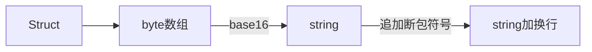

# C++结构体转Java bean

## 背景

最近接到一个任务，是Java端接收C++转发的车机数据，处理之后再写入到RabbitMq，后续处理暂且不说，重点说下Java端接收C++数据的事儿

## 常用解决方案

常用的解决方案是使用跨语言通信框架，比如上篇提到的thrift，还有很多，例如：

protobuf

xml

json

## 开整

可怕的是，这次的系统，对应是已经存在很长时间的C++端，之前都是通过C#做客户端接收，一直使用的是结构体（Struct），很多子系统对接这个服务端，现在想要改用第三方协议，已经不靠谱了

看一下服务端处理流程




数据样例

```shell
00000C0042ED3B5C9EAE446D200000000E6100005ABA9A4948650000546A81516A450E000100011123ED3B5C058924008A786A002D3B00000000000000000000
```


结构体样例

```c++
 public struct BSBCP_ACTION
    {
        public byte nActionState;	// 应答状态 最高位0, 消息 1 此结构为BSBCP_BaseDataSet; 最低位0,不需要接收者应答,1需要接收者应答;第二位 0, 不需要传递着应答,1 需要传递者应答
        public ushort cmd_type; // 指令类型
        public int tm_sendtime; // 指令发送时间
        public uint cmd_Serial; // 指令流水号
        public uint cmd_length; // 指令长度
    };
```

注意看其中的ushort和uint，无符号类型，java里没有无符号类型，说白了就是不存储负值，从0开始，正值比有符号的最大值大一倍，当时第一反应，没问题啊，可以范围更大一级的数据接收，比如：用int接收ushort、用long接收uint

开动（这个项目数据吞吐量较大，据说有3W车机，每3秒一包数据，所以socket的选择上，选择了netty，没用已经熟悉的mina，关于netty，等后边再写一篇，这篇主要讲结构体的解析）

```java
// 通过netty接收到的字节数组
byte[] bytes = (byte[]) messge;
// 转换为字符串
String messageStr = new String(bytes);
// 去除断包符号
messageStr = messageStr.replaceAll("\r\n", "");
// 转换字节数组，用到了下面的工具类
byte[] datas = HexUtil.str2Bytes(messageStr);
```

```java
package com.ivp.util;

/**
 * @文件名 HexUtil.java
 * @描述 Hex工具
 * @author cuijiyong
 * @创建日期 2019/1/16
 */
public class HexUtil {

    /**
     * hex转byte数组
     * @param hex
     * @return
     */
    public static byte[] hex2Bytes(String hex){
        int m = 0, n = 0;
        // 每两个字符描述一个字节
        int byteLen = hex.length() / 2;
        byte[] ret = new byte[byteLen];
        for (int i = 0; i < byteLen; i++) {
            m = i * 2 + 1;
            n = m + 1;
            int intVal = Integer.decode("0x" + hex.substring(i * 2, m) + hex.substring(m, n));
            ret[i] = (byte) intVal;
        }
        return ret;
    }

    /**
     * byte数组转hex
     * @param b
     * @return
     */
    public static String bytes2HexString(byte[] b) {
        StringBuffer result = new StringBuffer();
        for (int i = 0; i < b.length; i++) {
            result.append(String.format("%02X", b[i]));
        }
        return result.toString();
    }

}
```

## 出事儿了

字节数组开始转Java Bean吧， 对应上边的协议说明，我做了如下实体

```java
/**
     * 状态
     */
    private byte state;
    /**
     * 指令类型
     */
    private int messageType;
    /**
     * 指令时间
     */
    private int messageTime;
    /**
     * 指令序列号
     */
    private long serialNumber;
    /**
     * 指令数据长度
     */
    private long contentLength;
    /**
     * 发送方类型
     */
    private int senderType;
    /**
     * 发送方地址
     */
    private int senderAddr;
    /**
     * 接收方类型
     */
    private int receiverType;
    /**
     * 接收方地址
     */
    private int receiverAddr;

// getter setter ...
```

```java
// 然后用netty带的ByteBuf从byte[]read数据回来
byte state = buf.readByte();
int messageType = buf.readInt();

// ....
```

结果不报错，但是解析出来的数据就是跟服务器发送的对应不上，开始各种查资料，发现了[一个说明](https://www.cnblogs.com/huhu0013/p/4736725.html)

要注意大端对齐、小端对齐的事儿

感觉这么搞下去太费劲了，然后搞了两天，试出了一个靠谱的解决方案

[javolution](http://javolution.org/)

中间还试过类似其他框架，例如：JavaStruct，但是综合下来觉得这个最靠谱

## 解决思路：

### 定义一个java类，继承Struct类，声明数据类型

```java
package com.ivp.entity.struct;

import com.ivp.entity.BSBCPAction;
import com.ivp.entity.BaseEntity;
import org.slf4j.Logger;
import org.slf4j.LoggerFactory;

import java.nio.ByteOrder;
/**
 * @文件名 BSBCPActionStruct.java
 * @描述 指令头结构体
 * @author cuijiyong
 * @创建日期 2019/1/16
 */
public class BSBCPActionStruct extends LittleEndianStruct implements BaseStruct {
    private static Logger logger = LoggerFactory.getLogger(BSBCPActionStruct.class);
    /**
     * 状态
     */
    public final Signed8 state = new Signed8();
    /**
     * 指令类型
     */
    public final Unsigned16 messageType = new Unsigned16();
    /**
     * 指令时间
     */
    public final Signed32 messageTime = new Signed32();
    /**
     * 指令序列号
     */
    public final Unsigned32 serialNumber = new Unsigned32();
    /**
     * 指令体数据长度
     */
    public final Unsigned32 contentLength = new Unsigned32();
    /**
     * 发送方类型
     */
    public final Unsigned16 senderType = new Unsigned16();
    /**
     * 发送方地址
     */
    public final Signed32 senderAddr = new Signed32();
    /**
     * 接收方类型
     */
    public final Unsigned16 receiverType = new Unsigned16();
    /**
     * 接收方地址
     */
    public final Signed32 receiverAddr = new Signed32();

    public BSBCPActionStruct() {
    }

    @Override
    public BaseEntity toEntity(){
        BSBCPAction bsbcpaction = new BSBCPAction();
        bsbcpaction.setState(state.get());
        bsbcpaction.setMessageType(messageType.get());
        bsbcpaction.setMessageTime(messageTime.get());
        bsbcpaction.setSerialNumber(serialNumber.get());
        bsbcpaction.setContentLength(contentLength.get());
        bsbcpaction.setSenderType(senderType.get());
        bsbcpaction.setSenderAddr(senderAddr.get());
        bsbcpaction.setReceiverType(receiverType.get());
        bsbcpaction.setReceiverAddr(receiverAddr.get());
        return bsbcpaction;
    }
}

```

注意看，这里已经可以声明无符号类型了

### 然后声明实体和结构体对应

```java
package com.ivp.entity;

import com.ivp.entity.struct.BSBCPActionStruct;
import com.ivp.entity.struct.BaseStruct;
import com.ivp.util.ConstantUtil;

import java.io.Serializable;

/**
 * @文件名 BSBCPAction.java
 * @描述 协议头实体
 * @author cuijiyong
 * @创建日期 2019/1/14
 */
public class BSBCPAction implements Serializable,BaseEntity {

    private static final Long serialVersionUID = 234234L;

    /**
     * 状态
     */
    private byte state;
    /**
     * 指令类型
     */
    private int messageType;
    /**
     * 指令时间
     */
    private int messageTime;
    /**
     * 指令序列号
     */
    private long serialNumber;
    /**
     * 指令数据长度
     */
    private long contentLength;
    /**
     * 发送方类型
     */
    private int senderType;
    /**
     * 发送方地址
     */
    private int senderAddr;
    /**
     * 接收方类型
     */
    private int receiverType;
    /**
     * 接收方地址
     */
    private int receiverAddr;

    /**
     * 指令头长度
     */
    public static final int MESSAGE_LENGTH = 32;

    public BSBCPAction() {
        this.serialNumber = 1;
        this.state = ConstantUtil.DEFAULT_STATE;
        this.messageTime = (int) (System.currentTimeMillis() / 1000);
        this.senderType = ConstantUtil.DEFAULT_SENDER_TYPE;
        this.senderAddr = ConstantUtil.DEFAULT_SENDER_ADDR;
        this.receiverType = ConstantUtil.DEFAULT_RECEIVER_TYPE;
        this.receiverAddr = ConstantUtil.DEFAULT_RECEIVER_ADDR;
    }

    public BSBCPAction(byte state, int messageType, int messageTime, long serialNumber, long contentLength, int senderType, int senderAddr, int receiverType, int receiverAddr) {
        this.state = state;
        this.messageType = messageType;
        this.messageTime = messageTime;
        this.serialNumber = serialNumber;
        this.contentLength = contentLength;
        this.senderType = senderType;
        this.senderAddr = senderAddr;
        this.receiverType = receiverType;
        this.receiverAddr = receiverAddr;
    }

    public static Long getSerialVersionUID() {
        return serialVersionUID;
    }

    public byte getState() {
        return state;
    }

    public void setState(byte state) {
        this.state = state;
    }

    public int getMessageType() {
        return messageType;
    }

    public void setMessageType(int messageType) {
        this.messageType = messageType;
    }

    public int getMessageTime() {
        return messageTime;
    }

    public void setMessageTime(int messageTime) {
        this.messageTime = messageTime;
    }

    public long getSerialNumber() {
        return serialNumber;
    }

    public void setSerialNumber(long serialNumber) {
        this.serialNumber = serialNumber;
    }

    public long getContentLength() {
        return contentLength;
    }

    public void setContentLength(long contentLength) {
        this.contentLength = contentLength;
    }

    public int getSenderType() {
        return senderType;
    }

    public void setSenderType(int senderType) {
        this.senderType = senderType;
    }

    public int getSenderAddr() {
        return senderAddr;
    }

    public void setSenderAddr(int senderAddr) {
        this.senderAddr = senderAddr;
    }

    public int getReceiverType() {
        return receiverType;
    }

    public void setReceiverType(int receiverType) {
        this.receiverType = receiverType;
    }

    public int getReceiverAddr() {
        return receiverAddr;
    }

    public void setReceiverAddr(int receiverAddr) {
        this.receiverAddr = receiverAddr;
    }

    @Override
    public BaseStruct toStruct(){
        BSBCPActionStruct BSBCPActionStruct = new BSBCPActionStruct();
        BSBCPActionStruct.state.set(state);
        BSBCPActionStruct.messageType.set(messageType);
        BSBCPActionStruct.messageTime.set(messageTime);
        BSBCPActionStruct.serialNumber.set(serialNumber);
        BSBCPActionStruct.contentLength.set(contentLength);
        BSBCPActionStruct.senderType.set(senderType);
        BSBCPActionStruct.senderAddr.set(senderAddr);
        BSBCPActionStruct.receiverType.set(receiverType);
        BSBCPActionStruct.receiverAddr.set(receiverAddr);
        return BSBCPActionStruct;
    }

    @Override
    public String toString() {
        return "BSBCPAction{" +
                "state=" + state +
                ", messageType=" + messageType +
                ", messageTime=" + messageTime +
                ", serialNumber=" + serialNumber +
                ", contentLength=" + contentLength +
                ", senderType=" + senderType +
                ", senderAddr=" + senderAddr +
                ", receiverType=" + receiverType +
                ", receiverAddr=" + receiverAddr +
                '}';
    }
}
```

### 转换

```java
 /**
     * byte数组转实体
     * @param data 字节数组
     * @param start 开始位置
     * @param s 结构体类型
     * @return 对应的实体对象
     */
    public static BaseEntity getEntity(byte[] data, int start, Class<? extends Struct> s){
//        logger.info("开始转换实体，开始位置：{}， 结构体：{}", start, s);
        BaseStruct baseStruct = null;
        try {
            Struct struct = s.newInstance();
            ByteBuffer byteBuffer = ByteBuffer.wrap(data);
            byteBuffer.order(struct.byteOrder());
            struct.setByteBuffer(byteBuffer, start);
            baseStruct = (BaseStruct) struct;
        } catch (InstantiationException | IllegalAccessException e) {
            e.printStackTrace();
        }
        return baseStruct.toEntity();
    }
```

### 使用

```java
@Override
    public void channelRead(ChannelHandlerContext ctx, Object msg) throws Exception {
        try {
            // 获取接收到的数据
            ByteBuf byteBuf = (ByteBuf) msg;
            byte[] bytes = new byte[byteBuf.readableBytes()];
            byteBuf.readBytes(bytes);
            // 转换hex并去除断包符
            String hexStr = new String(bytes).replaceAll(ConstantUtil.SPLIT_STR, "");
            // 转换字节数组
            byte[] messageBytes = HexUtil.hex2Bytes(hexStr);
            // 获取指令头
            BSBCPAction bsbcpAction = (BSBCPAction) ProtocolUtil.getEntity(messageBytes, 0, BSBCPActionStruct.class);
//            logger.info("BSBCPAction ======== {}", Arrays.toString(messageBytes));

            // 判断指令头
            switch (bsbcpAction.getMessageType()){
                // 心跳
                case ConstantUtil.BSBCP_CMD_HEARTBEAT:{
                    BSBCPHeartbeat bsbcpheartbeat = (BSBCPHeartbeat) ProtocolUtil.getEntity(messageBytes,
                            BSBCPAction.MESSAGE_LENGTH, BSBCPHeartbeatStruct.class);
                    logger.info("收到心跳包：{}", bsbcpheartbeat);
                    break;
                }
                // 服务器回复
                case ConstantUtil.BSBCP_CMD_REPLY:{
                    BSBCPReply bsbcpReply = (BSBCPReply) ProtocolUtil.getEntity(messageBytes,
                            BSBCPAction.MESSAGE_LENGTH,
                            BSBCPReplyStruct.class);
                    if(bsbcpReply != null){
                        operateCmdReply(bsbcpReply, messageBytes, ctx);
                    }else{
                        logger.error("解析错误，空的reply");
                    }
                    break;
                }
                // 车辆状态
                case ConstantUtil.BSBCP_CMD_BUS_STATE:{
                    BSBCPBusState bsbcpBusState = (BSBCPBusState) ProtocolUtil.getEntity(messageBytes,
                            BSBCPAction.MESSAGE_LENGTH, BSBCPBusStateStruct.class);
                    if(bsbcpBusState != null) {
                        operateCmdBusState(bsbcpBusState, messageBytes, ctx);
                    }else{
                        logger.error("解析错误，空的bus state");
                    }
                    break;
                }
                default:
                    break;
            }
        }catch (Exception e){
            e.printStackTrace();
        }finally {
            ReferenceCountUtil.release(msg);
        }
    }
```

