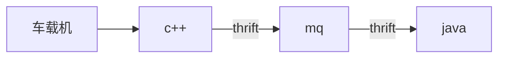

# 字符编码转换，真的是一行代码就能解决吗？
## thrift的故事

事情是这样的，今天做项目时遇到一个问题，c++端通过thrift发送的数据，java端作为thrift客户端接收，解析为实体后中文乱码，联系上游服务开发人员，说是gbk编码的，我就在实体get到字符串后各种尝试转换编码，无奈无论怎么转换都不得其解。
尝试了等等类似的方式

```java
new String(str.getBytes("gbk"), "utf-8")
```
[太长不看最终解决方案见网站](https://blog.csdn.net/hotallen/article/details/12425941)

不过我觉得调查过程还是挺有意思的，回顾数据流程


开发过程中使用tcp工具发送包进行测试，数据格式
```
7E 12 0C 00 3C 00 00 00 00 00 00 00 3D 00 00 
00 8C 1B 00 00 00 00 00 00 00 00 00 00 00 00 
00 00 00 00 00 00 00 01 00 05 31 34 30 C2 B7 
0A B9 FA BC CA C6 FB B3 B5 B3 C7 0A B9 FA BC 
CA C6 FB B3 B5 B3 C7 02 30 30 02 30 30 CC 7E
```
本来想找个在线工具hex转字符串看下明文，结果在线的基本都是utf8，直接乱码，所以跟上游系统要了下明文，通过观察数据规律发现有三处中文，其中有两处中文的内容一样，5个汉字，搜索了下gbk编码表，找到一个能搜索的，很不错
[GBK编码表](https://www.qqxiuzi.cn/zh/hanzi-gbk-bianma.php)
用明文反向查了下，得出目标中文hex是
```
B9 FA BC 
CA C6 FB B3 B5 B3 C7
```


我开发java端，监听mq，处理代码如下
```java
    TMemoryBuffer tmb = null;
    CJSJCCDTO cjsjccdto = new CJSJCCDTO();
    tmb = new TMemoryBuffer(32);
    tmb.write(data);
    TProtocol tp = new org.apache.thrift.protocol.TCompactProtocol(tmb);
    cjsjccdto.read(tp);
```
然后通过实体 get属性就中文乱码了，看了下tcp工具里的数据，用的hex字符串，那我就去搜索了下，找到下面的工具能在byte[]、hexString、各种编码的String之间转换，最后的main方法里，测试了一段hex，转换成功了

```java
package com.zd.test;

import java.io.UnsupportedEncodingException;
import java.util.ArrayList;
import java.util.Arrays;
import java.util.HashMap;
import java.util.List;
import java.util.Map;

public class TTT {
	/**
	 * @Title:bytes2HexString @Description:字节数组转16进制字符串 @param b 字节数组 @return
	 * 16进制字符串 @throws
	 */
	public static String bytes2HexString(byte[] b) {
		StringBuffer result = new StringBuffer();
		for (int i = 0; i < b.length; i++) {
			result.append(String.format("%02X", b[i]));
		}
		return result.toString();
	}

	/**
	 * @Title:hexString2Bytes @Description:16进制字符串转字节数组 @param src
	 * 16进制字符串 @return 字节数组 @throws
	 */
	public static byte[] hexString2Bytes(String src) {
		int l = src.length() / 2;
		byte[] ret = new byte[l];
		for (int i = 0; i < l; i++) {
			ret[i] = Integer.valueOf(src.substring(i * 2, i * 2 + 2), 16).byteValue();
		}
		return ret;
	}

	/**
	 * @Title:string2HexUTF8 @Description:字符UTF8串转16进制字符串 @param strPart
	 * 字符串 @return 16进制字符串 @throws
	 */
	public static String string2HexUTF8(String strPart) {

		return string2HexString(strPart, "UTF-8");
	}

	/**
	 * @Title:string2HexUnicode @Description:字符Unicode串转16进制字符串 @param strPart
	 * 字符串 @return 16进制字符串 @throws
	 */
	public static String string2HexUnicode(String strPart) {

		return string2HexString(strPart, "Unicode");
	}

	/**
	 * @Title:string2HexGBK @Description:字符GBK串转16进制字符串 @param strPart
	 * 字符串 @return 16进制字符串 @throws
	 */
	public static String string2HexGBK(String strPart) {

		return string2HexString(strPart, "GBK");
	}

	/**
	 * @Title:string2HexString @Description:字符串转16进制字符串 @param strPart
	 * 字符串 @param tochartype hex目标编码 @return 16进制字符串 @throws
	 */
	public static String string2HexString(String strPart, String tochartype) {
		try {
			return bytes2HexString(strPart.getBytes(tochartype));
		} catch (Exception e) {
			return "";
		}
	}

	/**
	 * @Title:hexUTF82String @Description:16进制UTF-8字符串转字符串 @param src
	 * 16进制字符串 @return 字节数组 @throws
	 */
	public static String hexUTF82String(String src) {

		return hexString2String(src, "UTF-8", "UTF-8");
	}

	/**
	 * @Title:hexGBK2String @Description:16进制GBK字符串转字符串 @param src
	 * 16进制字符串 @return 字节数组 @throws
	 */
	public static String hexGBK2String(String src) {

		return hexString2String(src, "GBK", "UTF-8");
	}

	/**
	 * @Title:hexUnicode2String @Description:16进制Unicode字符串转字符串 @param src
	 * 16进制字符串 @return 字节数组 @throws
	 */
	public static String hexUnicode2String(String src) {
		return hexString2String(src, "Unicode", "UTF-8");
	}

	/**
	 * @Title:hexString2String @Description:16进制字符串转字符串 @param src
	 * 16进制字符串 @return 字节数组 @throws
	 */
	public static String hexString2String(String src, String oldchartype, String chartype) {
		byte[] bts = hexString2Bytes(src);
		try {
			if (oldchartype.equals(chartype))
				return new String(bts, oldchartype);
			else
				return new String(new String(bts, oldchartype).getBytes(), chartype);
		} catch (Exception e) {

			return "";
		}
	}
	public static void main(String[] args) {
		// B9 FA BC CA C6 FB B3 B5 B3 C7 上边有hex2bytes
		System.out.println(hexGBK2String(bytes2HexString(new byte[] {-71, -6, -68, -54, -58, -5, -77, -75, -77, -57})));
		
	}
}


```
然后在业务代码里用cjsjccdto.getxxx().getBytes()，使用工具类转换，发现还是乱码，反向查吧，输出cjsjccdto.getxxx().getBytes()发现结果是
```
63, 63, 63, 63, 63, 63, 63, 63, 63, 63
```
正常应该是
```
-71, -6, -68, -54, -58, -5, -77, -75, -77, -57
```
这。。。能转换就怪了，这已经不是什么编码问题了，再怎么getBytes加编码，也取不出正确值了，所以把目标锁定到了
```java
org.apache.thrift.protocol.TCompactProtocol(tmb);
cjsjccdto.read(tp);
```
觉得应该是过程中没处理编码,所以去搜索,才搜索到了上边的最终解决方案...万恶的编码...回头看那个工具（虽然最后没用上，不过理清了很多思路），猛然间想起了之前做的一个中文扫码枪在swing窗口里读取信息的过程，现在回想起依然瑟瑟发抖

## 中文扫码枪的故事
在一个项目里需要做扫码入库,当时客户端采用的java swing做gui(不要问我为什么要用java做c/s),扫码枪+蓝牙接收器模拟键盘输入,不需要驱动,打开记事本直接就能扫描二维码,得出中文,美滋滋,合并到客户端系统里,扫描同一个二维码,乱码...过程很艰辛,最终找到规律，监听键盘事件（扫码枪模拟键盘事件）发现输入汉字的时候，它是这么做的
```
18 100 105 104 105 102 18 100 102 101 99 98
```
keycode 18 是 alt

keycode 96 是 0

keycode 97 是 1

keycode 98 是 2

...

keycode 105是 9

参照[keycode对照表](https://www.cnblogs.com/daysme/p/6272570.html)

所以上面的键盘事件是
alt 4 9 8 9 6
alt 4 6 5 3 2
看到这的时候，心里猛然一惊，我记得小时候玩过，在记事本里，按住alt，然后输入5个数字，松开alt，就能显示一个文字，赶紧打开记事本试了下，先按住alt不放，再按49896，松开alt，再按下alt不放，再按46532，松开alt，我的下巴都快掉下来了，这里我觉得有必要上一张图


我恨我自己小时候不求甚解，赶紧查了下这是什么[原理](https://zhidao.baidu.com/question/539585538.html)

验证一下吧，再次祭出gbk编码表，找到C2E8,B5C4，打开win的计算器，类型选程序员，输入上面的两个十六进制，看看得到的十进制是不是49896 46532

既然已经知道了，接下来就是从键盘事件转字符串了，做了个工具类，注释我认为很清晰，不接受反驳
```java
/**  
 * @Title: ScannerGunUtil.java
 * @Package 
 * @author donny
 * @date 2017年12月20日
 * @version V1.0  
 */
package com.icw.utils;

import java.io.UnsupportedEncodingException;
import java.util.HashMap;
import java.util.List;
import java.util.Map;

/**
 * @ClassName: ScannerGunUtil
 * @Description: 二维码扫描器工具类
 * @author donny
 * @date 2017年12月20日
 * @since JDK 1.8
 */
public class ScannerGunUtil {
	/**
	 * @Fields CODE_SIZE : 中文输入gbk码时，几位为一个中文
	 */
	private static final int CODE_SIZE = 5;
	/**
	 * @Fields ALT_CODE : ALT键的keycode
	 */
	private static final int ALT_CODE = 18;
	/**
	 * @Fields keyCodeMapping : keycode与ascii码的映射
	 */
	private static Map<Integer, String> keyCodeMapping = new HashMap<>();
	static {
		// 将0~9数字的keycode做成ascii码映射
		for(int i = 0; i < 10; i++) {
			keyCodeMapping.put(96+i, String.valueOf(i));
		}
	}
	
	public static String getKeyByCode(Integer keyCode) {
		return keyCodeMapping.get(keyCode);
	}
	
	/**
	 * @Title: convertCodeToString
	 * @Description: 转换keycode集合为字符串
	 * @param codeList keycode集合
	 * @return 字符串
	 */
	public static String convertCodeToString(List<Integer> codeList) {
		StringBuffer result = new StringBuffer();
		for(int i=0; i<codeList.size(); i++) {
			int current = codeList.get(i);
			// 一个中文
			if(current == ALT_CODE) {
				StringBuffer buffer = new StringBuffer();
				// 获取alt后面5个（alt+5个数字是中文）
				for(int j = 0; j < CODE_SIZE; j++) {
					buffer.append(getKeyByCode(codeList.get(i+j+1)));
				}
				// 获取扫码枪输出的gbk码（根据gbk编码表）
				Integer currentChinese = Integer.valueOf(buffer.toString());
				try {
					// 将输入的五位gbk编码转为对应的汉字，并追加到结果中
					result.append(new String(String.valueOf((char)currentChinese.intValue()).getBytes("UnicodeBigUnmarked"), "GBK"));
				} catch (UnsupportedEncodingException e) {
					e.printStackTrace();
				}
				i += CODE_SIZE;
				
			}else {
				result.append((char)current);
			}
		}
		return result.toString();
	}
	
}
```

所以，转码真的是一行代码解决吗？